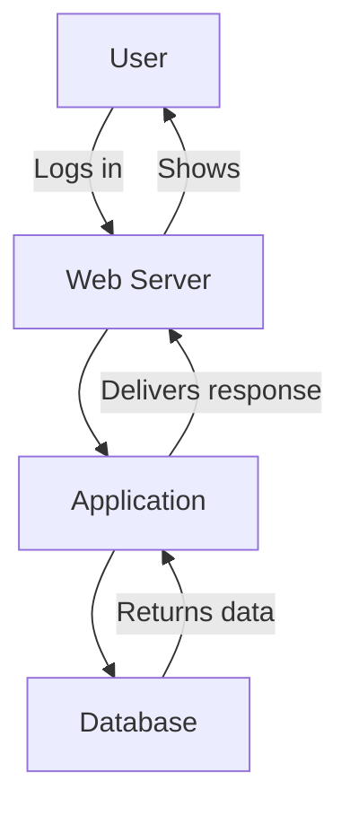

```mermaid
  graph TD;
      A[User] -->|Logs in| B[Web Server];
      B --> C[Application];
      C --> D[Database];
      D -->|Returns data| C;
      C -->|Delivers response| B;
      B -->|Shows| A;
```